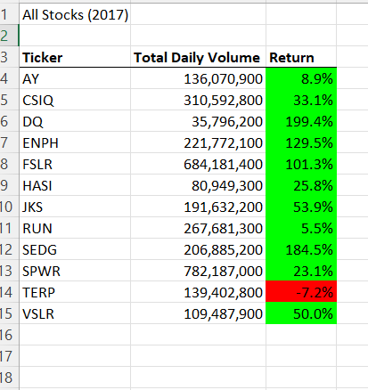
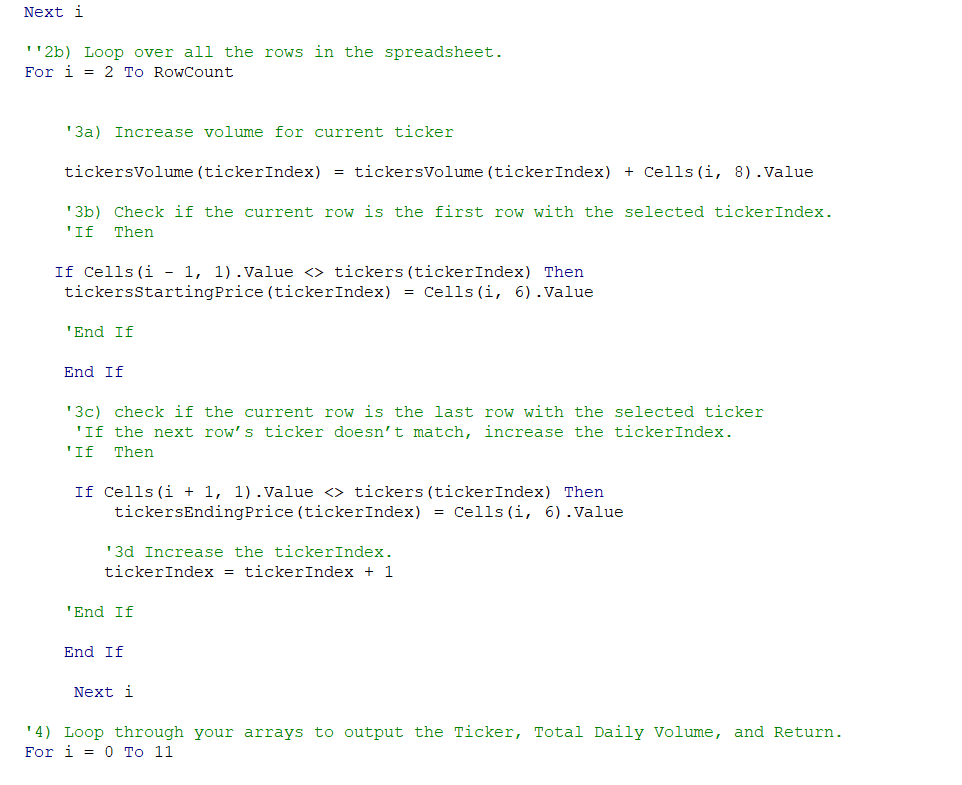
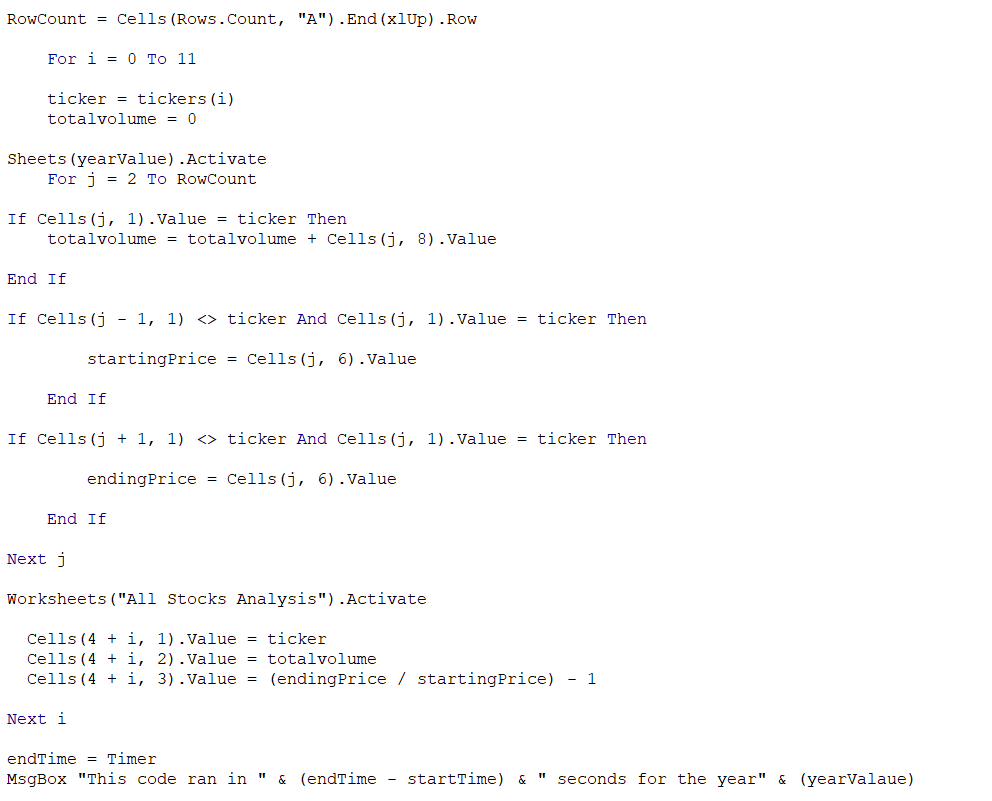
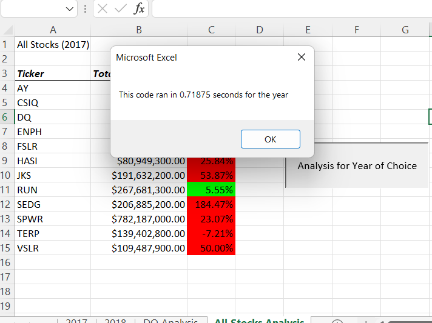
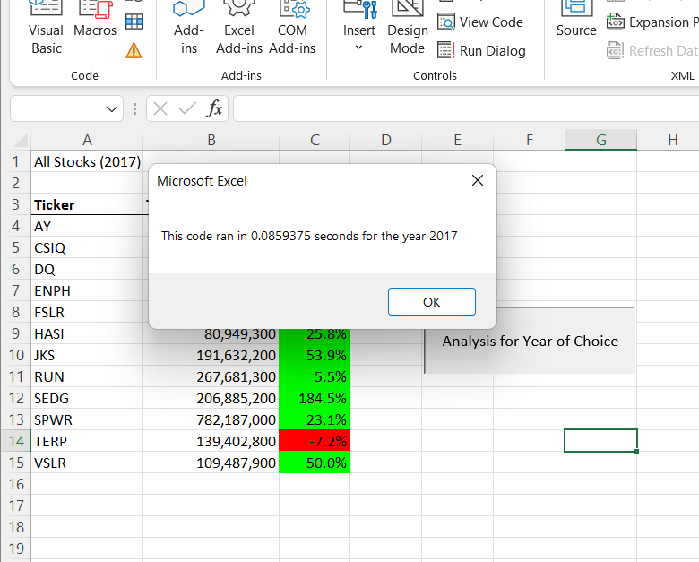
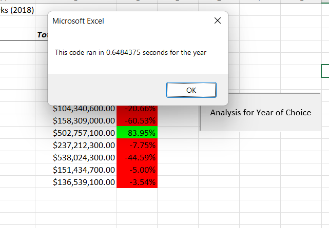
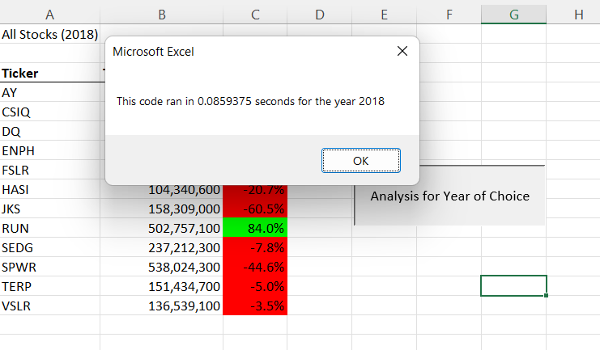

# Stock_Analysis

## Overview
This analysis was performed per a client's request to visualize and compare various enviornmentally friendly, "green" stocks' performancse over varying one year periods. The given data for the analyses was from 2017 and 2018, but the visualization program can be used to interpret datasets from different years if the data is provided for those stocks in Microsoft Excel in the same format. The stocks' return rate can be visualized as either positive or negative for the given year, and can be interpreted going from to one year to another in order for the client to make the desired selections based on the data. 
## Results
### Difference In Stock Performance From 2017 to 2018 
The data from 2017 shows positive returns on all data sets except one (TERP). However going into 2018, this postive return only continued for two stocks (RUN and ENPH). 

### Code Examples and Time Differences
The original code was vital to the final product, as many of the functions performed were refactored to improve the run time. The refactored code is able to more effectively loop through the data and perform the analysis, which provides for more client satisfaction. The refactored code is also more versatile. In the images below, the original code is shown in comparison to the refactored code. The refactored code's execution time was also significantly faster, which is seen in the images comparing the before and after time to run the analyses. 

## Summary
Reactoring code is adavantageous because it saves time and can be used as a method to continue improving on existing code, but it can also lead to errors if not done correctly and if the refactor requires fundamental changes. This can make the process take longer.
Refactoring VBA script is a useful skill, because it saved a lot of side during developmentafter putting in so much work in the original code. It also presented dificulties in the way of certain functions from the previous code being unusable due to differences in what was required in the new code. This led to errors which resulted in time lost in development until a new solution could be found. 
